# 🛩️ Flying Wing UAV - System Flowchart

## 📊 Sơ Đồ Hệ Thống UAV Flying Wing

```mermaid
flowchart TD
    %% ========== KHỐI NGUỒN ==========
    subgraph NGUỒN[Khối Nguồn & Phân Phối]
        direction TB
        PIN[Pin Li-ion 6S2P<br/>10400mAh] --> PDB[PDB<br/>Power Distribution Board]
        PDB --> ESC[ESC 120A x2<br/>Dual ESC]
        PDB --> UBEC[UBEC 5V/3A<br/>Flight Controller Power]
        PDB --> BUCK[Buck Converter<br/>12V to 5V]
    end

    %% ========== KHỐI ĐỘNG LỰC ==========
    subgraph ĐỘNG_LỰC[Khối Động Lực]
        direction TB
        ESC --> MOTOR1[Motor D4250 600KV<br/>Left]
        ESC --> MOTOR2[Motor D4250 600KV<br/>Right]
        UBEC --> SERVO[Servo Controls<br/>Optional]
    end

    %% ========== KHỐI ĐIỀU KHIỂN CHÍNH ==========
    subgraph ĐIỀU_KHIỂN[Khối Điều Khiển Chính]
        direction TB
        FC[Flight Controller<br/>LANRC F4 V3S Plus<br/>ArduPilot] --> SENSORS
        
        subgraph SENSORS[Cảm Biến]
            direction LR
            IMU[IMU<br/>Gyro/Accelerometer]
            GPS[GPS M10<br/>GNSS Module]
            COMPASS[La Bàn<br/>Magnetometer]
            BARO[Barometer<br/>Altitude]
            LIDAR[Lidar TF-Mini<br/>Height Sensor]
        end
        
        FC --> RX[RX ELRS 2.4GHz<br/>Radio Receiver]
    end

    %% ========== KHỐI MÁY TÍNH ĐỒNG HÀNH ==========
    subgraph ĐỒNG_HÀNH[Khối Máy Tính Đồng Hành]
        direction TB
        RPI[Raspberry Pi 3B+<br/>Companion Computer] --> AI_MODULES
        
        subgraph AI_MODULES[AI & Xử Lý]
            direction LR
            CAMERA[Camera Module<br/>RPi Camera OV5647]
            VISION[Computer Vision<br/>OpenCV + TFLite]
            QUANTUM[Quantum Filtering<br/>Research Module]
        end
        
        RPI --> COMMS[Communication<br/>5G/WiFi Module]
    end

    %% ========== KHỐI TRUYỀN THÔNG ==========
    subgraph TRUYỀN_THÔNG[Khối Truyền Thông]
        direction TB
        COMMS --> GS[Ground Station<br/>Web Dashboard]
        COMMS --> CLOUD[Cloud Storage<br/>Data Logging]
    end

    %% ========== KHỐI AN TOÀN ==========
    subgraph AN_TOÀN[Khối An Toàn]
        direction TB
        WATCHDOG[Watchdog Timer<br/>System Monitor]
        GEOFENCE[Geofencing<br/>Virtual Fence]
        FAILSAFE[Failsafe Systems<br/>RTL/Land]
        BATMON[Battery Monitor<br/>Smart Alerts]
    end

    %% ========== LUỒNG ĐIỀU KHIỂN ==========
    RX -- RC Commands --> FC
    FC -- MAVLink Telemetry --> RPI
    RPI -- MAVLink Commands --> FC
    
    %% ========== LUỒNG DỮ LIỆU CẢM BIẾN ==========
    IMU -- Sensor Data --> FC
    GPS -- Position Data --> FC
    COMPASS -- Heading --> FC
    BARO -- Altitude --> FC
    LIDAR -- Height AGL --> FC
    
    %% ========== LUỒNG XỬ LÝ AI ==========
    CAMERA -- Video Stream --> VISION
    VISION -- Object Detection --> RPI
    VISION -- Target Geolocation --> RPI
    QUANTUM -- Filtered IMU Data --> RPI
    
    %% ========== LUỒNG TRUYỀN THÔNG ==========
    RPI -- Telemetry Data --> COMMS
    RPI -- AI Results --> COMMS
    RPI -- Video Stream --> COMMS
    COMMS -- Real-time Data --> GS
    COMMS -- Log Data --> CLOUD
    
    %% ========== LUỒNG ĐIỀU KHIỂN ĐỘNG CƠ ==========
    FC -- Throttle Signals --> ESC
    FC -- Differential Thrust --> MOTOR1 & MOTOR2
    
    %% ========== LUỒNG NGUỒN ==========
    PIN -- Main Power --> PDB
    UBEC -- 5V Power --> FC
    BUCK -- 5V Power --> RPI
    BUCK -- 5V Power --> CAMERA
    BUCK -- 5V Power --> COMMS
    
    %% ========== LUỒNG AN TOÀN ==========
    FC -- System Status --> WATCHDOG
    GPS -- Position Check --> GEOFENCE
    BATMON -- Battery Status --> FAILSAFE
    WATCHDOG -- Restart Signal --> RPI
    GEOFENCE -- Boundary Alert --> FC
    FAILSAFE -- Emergency Actions --> FC

    %% ========== STYLING ==========
    classDef powerClass fill:#e1f5fe,stroke:#01579b,stroke-width:2px
    classDef motorClass fill:#f3e5f5,stroke:#4a148c,stroke-width:2px
    classDef controlClass fill:#e8f5e8,stroke:#1b5e20,stroke-width:2px
    classDef companionClass fill:#fff3e0,stroke:#e65100,stroke-width:2px
    classDef commsClass fill:#fce4ec,stroke:#880e4f,stroke-width:2px
    classDef safetyClass fill:#fff8e1,stroke:#ff6f00,stroke-width:2px
    
    class NGUỒN powerClass
    class ĐỘNG_LỰC motorClass
    class ĐIỀU_KHIỂN controlClass
    class ĐỒNG_HÀNH companionClass
    class TRUYỀN_THÔNG commsClass
    class AN_TOÀN safetyClass
```

## 🔗 Mô Tả Luồng Dữ Liệu

### 1. **Luồng Điều Khiển**
- **RC Receiver** → Flight Controller: Điều khiển thủ công từ pilot
- **Flight Controller** → Raspberry Pi: Telemetry data qua MAVLink
- **Raspberry Pi** → Flight Controller: Autonomous commands qua MAVLink

### 2. **Luồng Cảm Biến**
- **IMU/GPS/Compass** → Flight Controller: Dữ liệu navigation
- **Lidar** → Flight Controller: Đo độ cao thực tế
- **Camera** → Raspberry Pi: Video stream cho AI processing

### 3. **Luồng AI & Xử Lý**
- **Computer Vision**: Object detection và target tracking
- **Quantum Filtering**: Lọc nhiễu cảm biến (research module)
- **Target Geolocation**: Tính toán vị trí mục tiêu từ camera

### 4. **Luồng Truyền Thông**
- **5G/WiFi**: Real-time data streaming đến ground station
- **Web Dashboard**: Hiển thị telemetry và AI results
- **Cloud Storage**: Lưu trữ flight data và research data

### 5. **Luồng An Toàn**
- **Watchdog Timer**: Giám sát system health
- **Geofencing**: Ngăn UAV bay ra khỏi vùng an toàn
- **Failsafe Systems**: Tự động RTL/Land khi có sự cố

## 🎯 Đặc Điểm Hệ Thống

### **Flight Controller (ArduPilot)**
- **STM32F405**: Xử lý real-time flight control
- **Differential Thrust**: Điều khiển hướng bằng chênh lệch motor
- **Autonomous Navigation**: Waypoint following và loiter mode

### **Companion Computer (Raspberry Pi)**
- **Edge AI**: Xử lý computer vision trên device
- **MAVLink Integration**: Giao tiếp hai chiều với flight controller
- **Research Platform**: Quantum filtering experiments

### **Power Management**
- **Li-ion 6S2P**: High energy density cho flight time dài
- **Dual ESC**: Điều khiển riêng từng motor
- **Power Distribution**: Cấp nguồn ổn định cho tất cả components

## 📊 Hiệu Suất Hệ Thống

- **Flight Time**: 60-90 phút (tùy payload và điều kiện bay)
- **AI Processing**: 5-10 FPS object detection trên RPi 3B+
- **Communication Range**: Unlimited với 5G, ~1km với WiFi
- **Autonomy Level**: Fully autonomous với human oversight

---

*Sơ đồ này mô tả kiến trúc hệ thống UAV Flying Wing với đầy đủ các khối chức năng và luồng dữ liệu.*